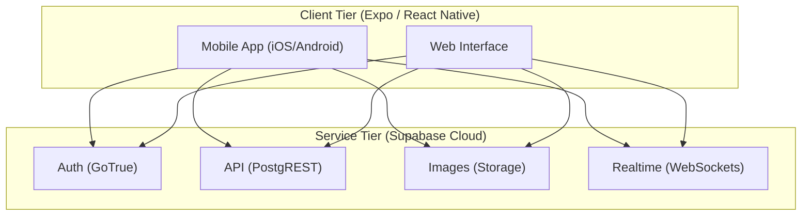
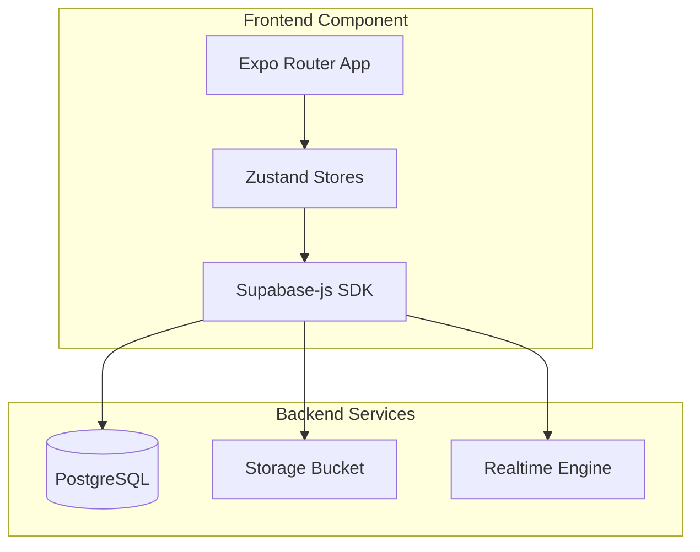
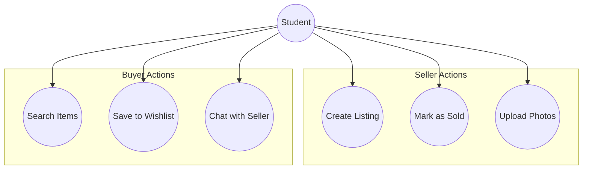
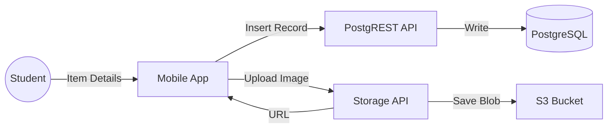
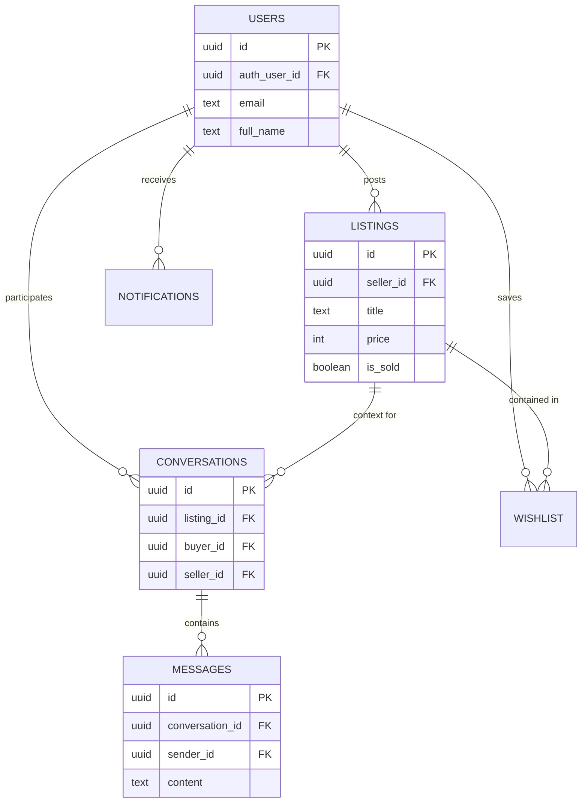
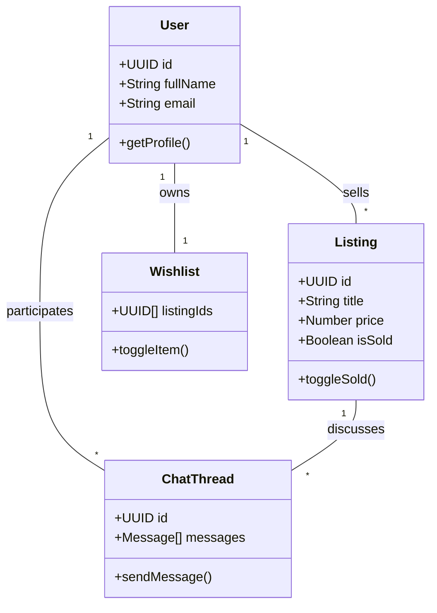
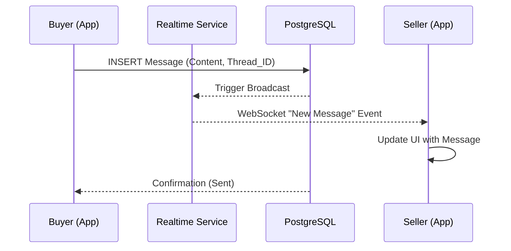

# CampusCart Architecture Documentation

This document outlines the technical architecture of **CampusCart**, a student-to-student marketplace designed for SRM KTR. The project follows a modern **Serverless (Backend-as-a-Service)** model to ensure rapid development, security, and scalability.

---

## 1. Application Architecture: Serverless (BaaS)

CampusCart utilizes a **Serverless Architecture** by leveraging **Supabase** as its core platform. Instead of maintaining a dedicated server environment (like a Node.js or Python backend), the application interacts directly with managed cloud services.

### Why Serverless?
- **Reduced Overhead**: The student team does not need to manage server infrastructure, OS updates, or scaling logic.
- **Security by Design**: Row Level Security (RLS) is handled at the database layer, ensuring that even if the client-side code is compromised, data access is restricted to authenticated users.
- **Real-time Capabilities**: Built-in support for WebSockets (Supabase Realtime) allows for instantaneous chat and notification updates without custom socket management.

### Deployment Diagram
This diagram shows the system hosted across the **Client Tier** (Expo) and the **Service Tier** (Supabase).

### Component Diagram
This diagram outlines the internal logical components of the system.

---

## 2. Behavioral & Logical Design

### 2.1 Use Case Diagram
This diagram details the core interactions between students and the system.

### 2.2 Data Flow Diagram (DFD Level 1)
This diagram maps how data travels through the system during a "Listing Creation" flow.

---

## 3. Database Design

### 3.1 ER Diagram
The database is structured as a relational schema with strictly enforced referential integrity.

### 3.2 Class Diagram
This diagram represents the logical object model used in the frontend application.

### 3.3 Schema Design Key Features
- **UUIDs**: All primary keys use `gen_random_uuid()` for global uniqueness across distributed environments.
- **RLS Policies**: Data access is governed by SQL policies (e.g., [(storage.foldername(name))[1] = auth.uid()::text](file:///c:/Users/BHAVANA/.gemini/antigravity/scratch/campuscart/stores/authStore.ts#27-32)), ensuring users can only modify their own data.
- **Triggers**: Automatic logic increments `sold_count` on the `users` table whenever a listing's `is_sold` flag is updated.

---

## 4. Data Exchange Contract

### 4.1 Frequency of Data Exchanges
- **On-Demand (Pull)**: Triggered by user interaction (e.g., refreshing the home feed, searching for a product, opening a profile).
- **Real-time (Push)**: Triggered by database events. When a message is inserted into the `messages` table, it is broadcasted via WebSockets to the recipient's active session.

### 4.2 Data Sets
1. **User Identity**: Metadata relating to student verification (SRM email domains) and contact info.
2. **Product Catalog**: Multi-tier data including category tagging, condition status, and location labels (UB, Tech Park, etc.).
3. **Communication Blobs**: Text-based chat history and chronological notification events.

### 4.3 Mode of Exchanges
- **RESTful API (JSON)**: Standard CRUD operations (Create, Read, Update, Delete) are performed via HTTPS POST/GET requests to the Supabase PostgREST endpoint.
- **WebSockets (Realtime)**: Used specifically for the **Chat System** and **Notifications** to provide a "live" feel.
- **Multipart/Form-Data**: Used for the **Storage API** to handle binary image uploads for listings.

---

## 5. Sequence Diagram: Student Inquiry Flow
This diagram demonstrates the flow of data when a buyer messages a seller.

